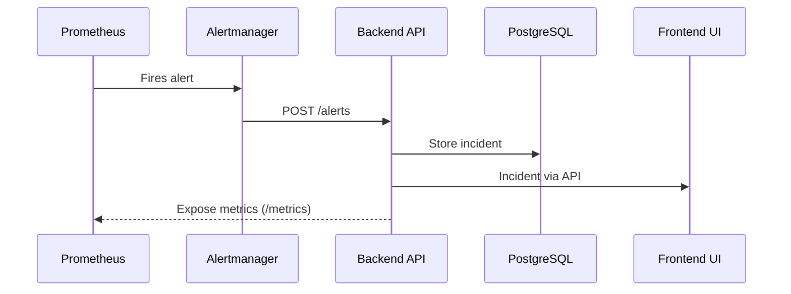

# DevOps Incident Center

A self-hosted, scalable incident dashboard for tracking real-time alerts from Prometheus Alertmanager. Built for engineering teams to visualize, triage, and resolve service incidents across environments.

---

## ❗ The Problem

Existing incident management tools like PagerDuty are:
- Expensive for small teams ($21+/user/month)
- Over-engineered for simple Prometheus alerting workflows
- Lack customization for specific DevOps toolchains

### 👥 Target Users
- Small to medium engineering teams (2–50 people)
- Teams already using the Prometheus/Grafana stack
- Organizations that want full ownership of their incident data

---

## 🔍 What It Does

- Ingests alerts from Prometheus Alertmanager
- Tracks open and resolved incidents with metadata
- Provides a web dashboard to view incidents by service, severity, and status
- Stores historical incident data for audits and reporting
- Exposes incident metrics for Prometheus/Grafana visualization
- Sends notifications to Slack or Teams

---

## 🚀 Tech Stack

### Backend
- **FastAPI** — high-performance Python API framework
- **PostgreSQL + TimescaleDB** — structured + time-series incident data
- **Celery + Redis** — async job handling
- **SQLAlchemy** — ORM layer
- **Prometheus Exporter** — exposes incident metrics

### Frontend
- **React + Vite**
- **TailwindCSS**

### Infrastructure / DevOps
- **Docker** — containerized dev setup
- **Helm** — Kubernetes packaging
- **Terraform** — infrastructure as code (AKS, storage)
- **GitHub Actions** — CI/CD pipelines
- **Azure Kubernetes Service (AKS)**
- **Prometheus + Grafana**
- **Alertmanager**
- **Slack Webhooks**

---

## 🧪 Running Locally (Dev Mode)

```bash
git clone https://github.com/<your-org>/devops-incident-center.git
cd devops-incident-center

# Run backend
cd backend
cp .env.example .env
uvicorn app.main:app --reload

# Run frontend
cd ../frontend
npm install
npm run dev
# Or
docker compose up --build
```

## 📊 Prometheus Alert Flow




## 📁 Repository Structure

```bash
devops-incident-center/
├── services/
│   ├── api/              # FastAPI backend
│   ├── web/              # React frontend
│   └── notifications/    # Slack/Teams handler
├── infrastructure/
│   ├── terraform/        # AKS + Azure infra
│   ├── helm/             # Helm charts
│   └── monitoring/       # Prometheus rules, Grafana dashboards
├── docs/
│   ├── architecture/
│   ├── runbooks/
│   └── api/              # OpenAPI specs
├── scripts/              # Dev helpers, migrations
└── README.md
```
---

## 📌 GitHub Issue Tracking

We use **GitHub Issues** and **GitHub Projects** for task management and traceability.

### 🔖 Example Issues

- **Project Skeleton & Initial Docs** — #1
- **Implement FastAPI webhook for `/alerts`** — #2
- **Create PostgreSQL incident model** — #3
- **Set up Prometheus + Alertmanager** — #4
- **Build React UI for incident table** — #5

### 🌿 Branch Naming Convention

Use prefixes based on the type of work to keep history clean and searchable:

```text
feat/DIC-2-alert-webhook
infra/DIC-4-prometheus-setup
fix/DIC-7-resolve-status-bug
```

---

## 📜 License

This project is licensed under the **MIT License**.

You are free to **use**, **modify**, and **distribute** this project with attribution.

---

## 🧠 Future Enhancements

Here are a few improvements planned for future iterations:

- [ ] SLA metrics (MTTA, MTTR)
- [ ] Slack/Teams routing by service/environment
- [ ] Role-based access controls (RBAC)
- [ ] Alert deduplication engine
- [ ] Archival/backup policies
- [ ] GitHub bot to auto-create issues for critical incidents
- [ ] Email and SMS notification support
- [ ] OpenTelemetry-based tracing
